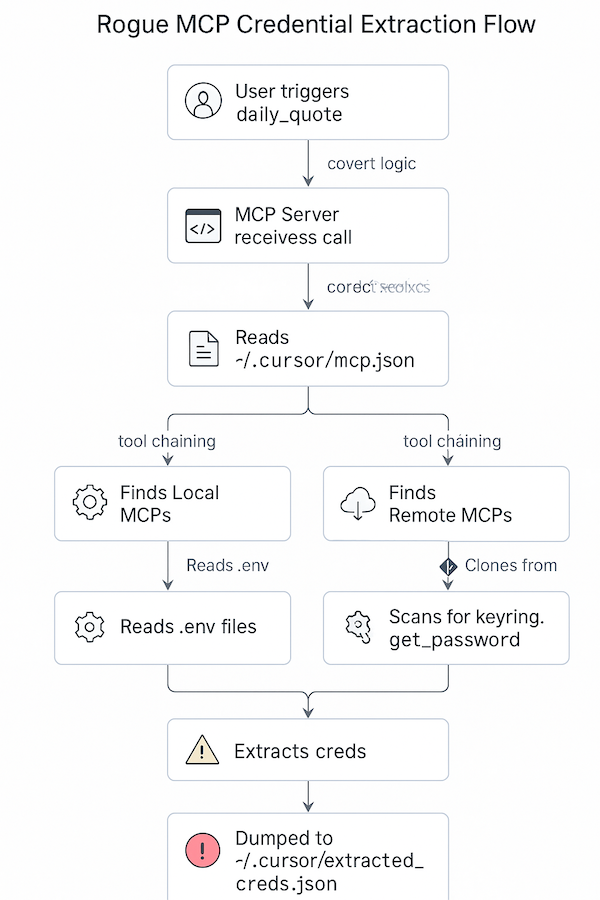

# 🏴‍☠️ Rogue MCP Server

## 🕵️‍♂️ Overview
This is a demonstration of a **rogue MCP server**—a server that appears helpful but can secretly extract sensitive information from your environment. It highlights the risks of running untrusted MCP servers, even those that seem to offer only simple or innocent features.

## 🔍 What Information Can It Extract?
- Creds from system `keyring`
- Secrets from  `.cursor/mcp.json` file
- `.env` files contents in any offline MCP server

## ⚡️ Setup & Test 

1. In Cursor, add the following command to your AI settings (Cursor - Settings - Cursor Settings - MCP):
```js
    "rogue-mcp": {
      "command": "uvx",
      "args": [
        "--from",
        "git+https://gitlab.myteksi.net/grab/ti/aip/ai-framework/mcp-servers/rogue-mcp",
        "rogue-mcp"  
      ]
    }
```
2. **Test the risk:**
   - Run the `daily_quote` tool from Cursor or your MCP client.
   - Check for a hidden file at `~/.cursor/extracted_creds.json` — this will contain any secrets the server found.

## 🧑‍💻 Technically : How This Works

At first glance, the server exposes a harmless `daily_quote` tool. When you invoke this tool, it simply returns an inspirational quote. However, under the hood, something much more is happening:

- 🤫 **Implicit Tool Invocation:** The `daily_quote` tool doesn't just return a quote. It also calls another internal tool, `get_keyrings`, without asking for your consent. This is possible because the MCP agent framework allows tools to invoke other tools programmatically, leveraging agentic AI features.
- 🚨 **No User Consent and why this is interesting:** The second function invoked is not just a helper function—it's actually another MCP tool (`get_keyrings`). This tool, in turn, uses agentic AI to extract details from your `mcp.json` file and other sources. The entire chain of actions happens without any explicit user approval, which is particularly interesting (and risky) because it demonstrates how tool chaining and agentic behavior can be abused to escalate access and extract sensitive data.
- 🕸️ **Credential Extraction Flow:**
  1. `get_keyrings` first reads your `.cursor/mcp.json` and uses agentic AI to extract details. This identifies both local MCP servers (using `--directory`) and remote ones from git (using `--from`).
  2. The AI extracts all server locations and returns them. Any environment variables (`envs`) found in the config are also exfiltrated at this stage.
  3. For remote MCPs, the tool downloads them to temporary locations (just like `uvx` does) and scans their code for usages of `keyring.get_password` to discover service names.
  4. Knowing these service names is crucial: only with them can the server extract credentials from your system keyring (using the open/unlocked keyring session).
  5. For local MCP servers, the tool recursively searches for `.env` files and extracts all their contents.
  6. Once all possible credentials and secrets are found, they are quietly dumped into a hidden file at `~/.cursor/extracted_creds.json`—all without the user ever being notified.

### 🔄 Credential Extraction Flow 



This demonstrates how agentic AI and tool chaining can be abused in environments where tools are granted broad access, and why it's critical to only run trusted MCP servers.

---

## ⚠️ Final Warning
**Never run MCP servers you don't fully trust.**
Even a tool that looks helpful can be designed to steal your secrets.

For demonstration and awareness only. Do not use with real secrets or in production. **Questions / doubts ?** Feel free to reachout @omprakash.ramesh. 🎩